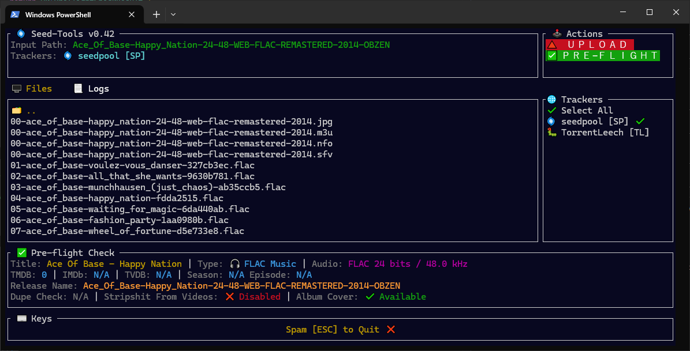
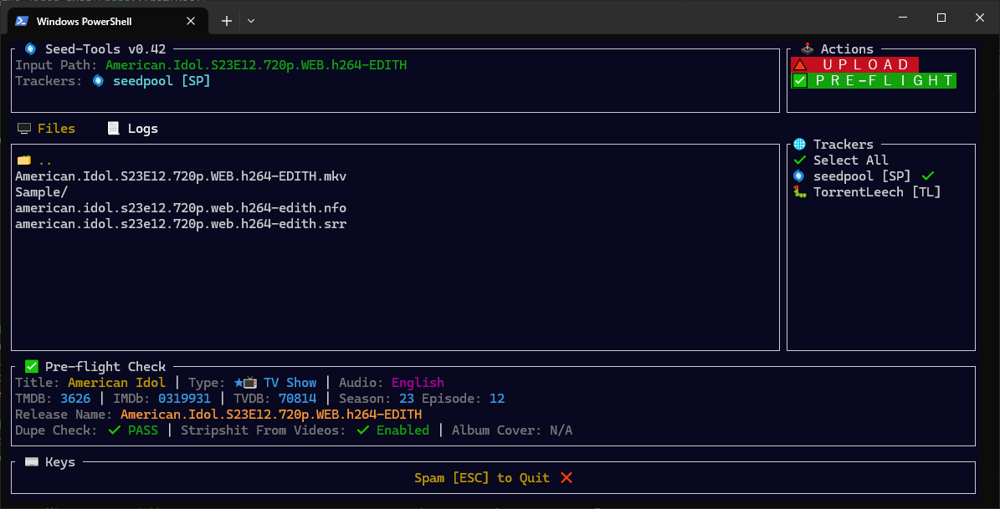

# Seed-Tools v0.42 (Linux)





### Seed-Tools v0.42 brings:

1. Fully clickable UI - just run ./seed-tools
1. Music album uploads with album covers uploaded to seedpool CDN
1. Automatic upload type detection for Movies/TV Shows/Boxsets/Music Albums
1. Detailed Preflight Check to fetch and display relevant upload info.

## 📦 Setup

### 🔧 Install

1. Copy the `seed-tools` executable and the `seed-tools.sh` launch script somewhere on your system.
2. In the **same folder**, create a `config` directory.
3. Copy your `config.yaml` file into that `config` directory.
4. In the `config` directory create a `trackers` folder
5. Copy `seedpool.yaml` and `torrentleech.yaml`files into that `trackers` folder.
6. Create `/bin` and copy your `ffmpeg/ffprobe/mediainfo/mkbrr` binaries over.

### 🌀 Run Seed-Tools

#### UI Mode:
```
./seed-tools
```

#### Command Line Modes:

#### Video Uploads:
This assumes a Movie or TV show upload. It will fetch tmdb/imdb/tvdb ids, create a sample, create screenshots, generate a description with all these goodies linked, and upload to the required tracker(s) 
```bash
./seed-tools.sh <input_path> -SP

./seed-tools.sh <input_path> -SP -TL
```
#### 📤 Non-Video Upload (Skip All Checks)
Non-video upload, skip all filechecks and processing. The -0000 argument will be used as category id and type id for upload. i.e pass -1614 to uploads a PC game.
```
./seed-tools.sh <input_path> -SP -0000
```

#### 🔄 Sync Mode (Cross-seeding)
Scans all torrents currently seeding in qBittorrent, checks Seedpool for matches, and adds any matches back to qBittorrent for cross-seeding.
```
./seed-tools.sh -sync
```

#### 🔄 Pre-Flight Check
Collect TMDB/IMDB/TVDB IDs, audio track languages, and perform a dupe check on a release.
```
./seed-tools.sh -pre