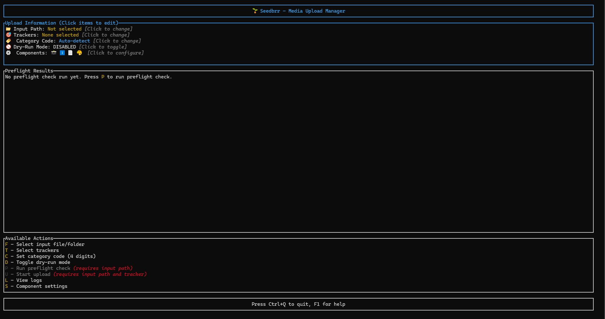

# seedbrr
[](https://www.rust-lang.org/)
[](LICENSE)




## Overview

seedbrr is a Rust-based automation tool designed to streamline the process of creating and uploading torrents to private trackers. It intelligently processes different content types (video, audio, ebooks, games, and general files) with specialized handling for each.

### Key Features

- 🎬 **Media-Centric Processing** - Specialized handlers for movies, TV shows, music, ebooks, games, and more
- 📝 **Template-Based Descriptions** - Customizable YAML/JSON templates for upload descriptions
- 🔍 **Intelligent Classification** - Automatic detection of media types and metadata extraction
- 🎨 **Component-Based Uploads** - Modular system for building uploads with screenshots, MediaInfo, and more
- 🚀 **Multi-Tracker Support** - Built-in support for multiple private trackers
- 🖼️ **Screenshot Generation** - Automatic screenshot creation with multiple layout options
- 📊 **Metadata Enrichment** - Integration with TMDB, MusicBrainz, IGDB, and Open Library
- 🔄 **Cross-Seeding** - Find and upload content across multiple trackers
- 💻 **Interactive TUI** - Terminal user interface for easy navigation and uploads
- 🎯 **4-Digit Code System** - Direct classification using tracker codes (CCTT format)

## Quick Start

```bash
# Install seedbrr
cargo install --path .

# Run interactive mode
./seedbrr

# Upload a movie
./seedbrr upload /path/to/movie.mkv --tracker seedpool

# Upload with specific category (using 4-digit code)
./seedbrr upload /path/to/content -t seedpool --code 0740

# Dry run to preview without uploading
./seedbrr upload /path/to/content -t seedpool --dry-run

# Preflight check
./seedbrr upload /path/to/content -t seedpool --pre
```

## Installation

### From Source

```bash
# Clone the repository
git clone https://github.com/yourusername/seedbrr.git
cd seedbrr

# Build release version
cargo build --release
# The binary will be at target/release/seedbrr
./build.sh # will generate you a seedbrr binary at your location
```

### Setup

1. Create the following directory structure:
```
seedbrr/
├── config/
│   ├── config.yaml
│   └── trackers/
│       ├── seedpool.yaml
│       └── torrentleech.yaml
├── bin/
│   ├── ffmpeg
│   ├── ffprobe
│   ├── mediainfo
│   └── mkbrr
├── screenshots/
└── torrents/
```

2. Configure your API keys and settings in `config/config.yaml`
3. Set up tracker-specific configurations in the `trackers/` directory

## Usage Examples

### Interactive UI Mode
```bash
./seedbrr
```
Navigate with arrow keys, select content, and upload with a few clicks!

### Command Line Mode

#### Video Uploads (Movies/TV Shows)
```bash
# Upload to Seedpool
./seedbrr upload /path/to/movie.mkv --tracker seedpool

# Upload to multiple trackers
./seedbrr upload /path/to/movie.mkv -t seedpool -t torrentleech

# Preflight check (preview without uploading)
./seedbrr upload /path/to/movie.mkv -t seedpool --pre

# Dry run (full process without final upload)
./seedbrr upload /path/to/movie.mkv -t seedpool --dry-run
```

#### Music Uploads
```bash
# Upload album with automatic MusicBrainz lookup
./seedbrr upload "/path/to/Artist - Album [FLAC]" -t seedpool

# Upload with specific audio category
./seedbrr upload /path/to/album -t seedpool --code 0140
```

#### E-Book Uploads
```bash
# Upload ebook with Open Library integration
./seedbrr upload /path/to/book.epub -t seedpool

# Upload comic book archive
./seedbrr upload /path/to/comic.cbz -t seedpool --code 0740

# Upload with specific ebook category
./seedbrr upload /path/to/book.pdf -t seedpool --code 0720
```

#### Game Uploads
```bash
# Upload PC game with IGDB integration
./seedbrr upload "/path/to/Game.Name-GROUP" -t seedpool

# Upload console game
./seedbrr upload /path/to/game.iso -t seedpool --code 1614
```

#### General Files (Hobby)
```bash
# Upload with specific category code
./seedbrr upload /path/to/files -t seedpool --code 5040
```

### Advanced Features

#### 4-Digit Code System
Direct classification using tracker-specific codes (format: CCTT)
- CC = Category code (e.g., 07 for comics, 16 for games)
- TT = Type code (e.g., 40 for specific format)

Example codes:
- `0140` - FLAC music
- `0720` - Ebook literature  
- `0740` - Comic books
- `1614` - PC games
- `5040` - General files

#### Template System
Create custom description templates in `config/templates/`:
```yaml
# video_template.yaml
name: "Custom Video Template"
sections:
  - type: title
    value: "{{title}} ({{year}})"
  - type: image
    urls: "{{screenshots}}"
    layout: Grid2x2
  - type: section
    title: "Plot"
    content: "{{tmdb_overview}}"
    format: quoted
```

#### Cross-Seeding
```bash
# Find cross-seed opportunities
./seedbrr sync

# Check specific content across trackers
./seedbrr cross-seed /path/to/content
```

## Media Type Support

### Video (Movies & TV Shows)
- Automatic movie/TV detection
- Season/episode parsing
- Resolution and codec detection
- TMDB metadata with fallback
- YouTube trailer integration
- Automatic screenshot generation
- Sample video creation

### Audio (Music & Podcasts)  
- Format detection (FLAC, MP3, AAC, etc.)
- MusicBrainz integration for metadata
- Automatic track listing extraction
- Source classification (CD, Vinyl, Web, etc.)
- Album artwork handling

### Ebooks & Comics
- EPUB, PDF, MOBI, AZW3 support
- CBR/CBZ comic archive support
- Open Library integration
- Automatic cover extraction
- Page count detection
- Multi-format ebook handling

### Games
- Platform detection (PC, Console, etc.)
- IGDB integration for metadata
- DLC and update detection
- Multi-disc support
- Scene release detection

### General Files (Hobby)
- Flexible classification
- Batch file handling
- Custom metadata support

## Configuration

### Main Configuration (`config/config.yaml`)
```yaml
general:
  tmdb_api_key: "your-tmdb-api-key"
  youtube_api_key: "your-youtube-api-key"
  igdb_client_id: "your-igdb-client-id"
  igdb_client_secret: "your-igdb-secret"

paths:
  screenshots: "./screenshots"
  torrents: "./torrents"
  temp: "/tmp/seedbrr"
  bin: "./bin"

screenshot:
  count: 4
  format: "jpg"
  quality: 95

clients:
  qbittorrent:
    host: "localhost"
    port: 8080
    username: "admin"
    password: "adminpass"
```

### Tracker Configuration (`config/trackers/seedpool.yaml`)
```yaml
tracker:
  name: "Seedpool"
  announce_url: "https://seedpool.org/announce"
  
api:
  base_url: "https://seedpool.org/api"
  key: "your-api-key"
  
upload:
  url: "https://seedpool.org/api/upload"
  
categories:
  movies: "01"
  tv: "02"
  music: "01"
  ebooks: "07"
  games: "16"
```

## Documentation

- [Getting Started](docs/getting-started.md) - Installation and basic setup
- [Configuration Guide](docs/configuration.md) - Detailed configuration options
- [Usage Examples](docs/usage-examples.md) - Common workflows and examples
- [Template System](docs/templates.md) - Creating custom description templates
- [Development Guide](docs/development.md) - Architecture and contributing

## Requirements

- **Rust** 1.70 or higher
- **External binaries** (place in `bin/` directory):
  - `ffmpeg` and `ffprobe` - Video processing
  - `mediainfo` - Media metadata extraction
  - `mkbrr` - Torrent creation

## Building from Source

```bash
# Clone the repository
git clone https://github.com/yourusername/seedbrr.git
cd seedbrr

# Build debug version
cargo build

# Build optimized release version
cargo build --release

# Run tests
cargo test

# Install to ~/.cargo/bin
cargo install --path .
```

## Contributing

Contributions are welcome! Please feel free to submit a Pull Request. For major changes:

1. Fork the repository
2. Create your feature branch 
3. Commit your changes
4. Push to the branch
5. Open a Pull Request to the development branch.

See [CONTRIBUTING.md](CONTRIBUTING.md) for detailed guidelines.

## License

This project is licensed under the MIT License - see the [LICENSE](LICENSE) file for details.

## Acknowledgments

- Built with [Rust](https://www.rust-lang.org/)
- Terminal UI powered by [ratatui](https://github.com/ratatui-org/ratatui)
- Integrates with:
  - [TMDB](https://www.themoviedb.org/) for movie/TV metadata
  - [MusicBrainz](https://musicbrainz.org/) for music metadata
  - [IGDB](https://www.igdb.com/) for game information
  - [Open Library](https://openlibrary.org/) for book data

## Support

For issues, questions, or contributions:
- Open an issue on [GitHub](https://github.com/yourusername/seedbrr/issues)
- Join the seedpool IRC server
- Check the [FAQ](docs/faq.md)